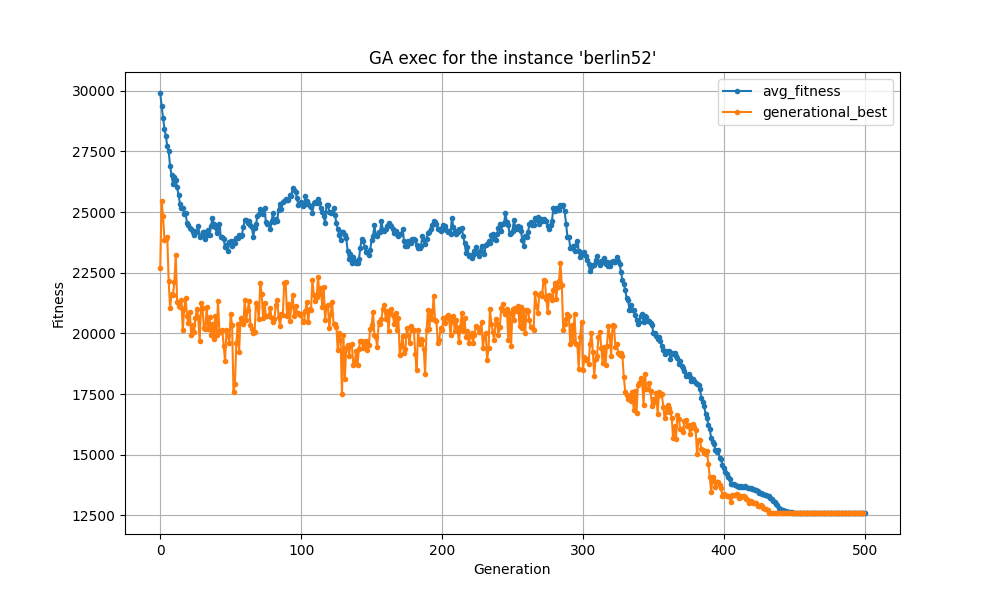
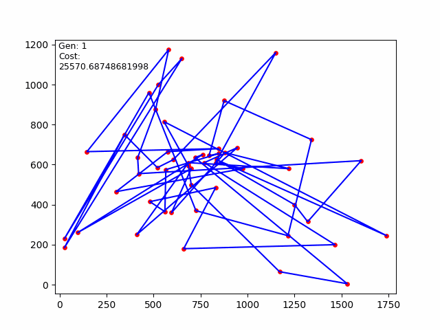
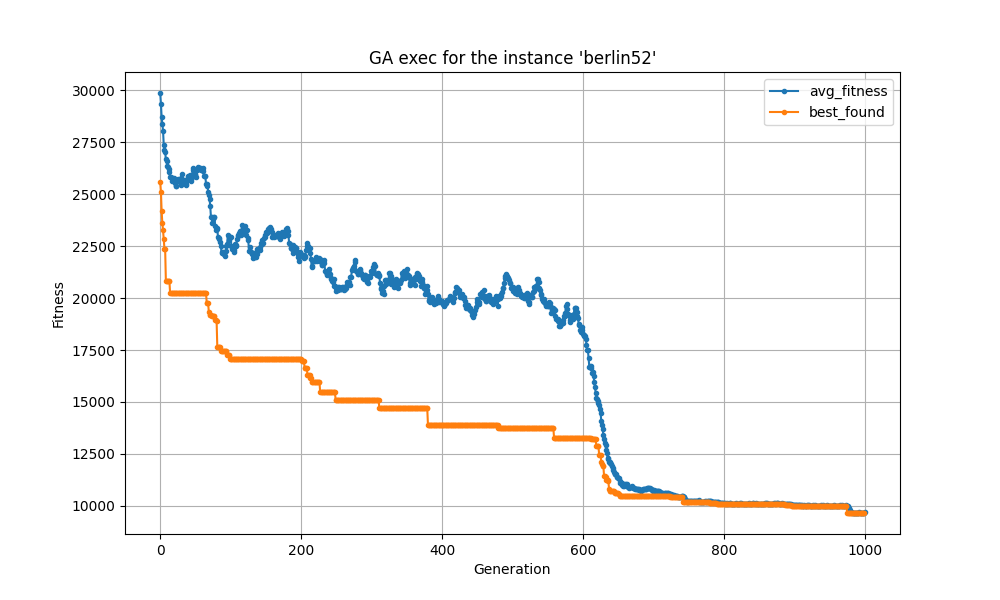

# evo_bio_computing
Implementations of heuristics, metaheuristics, evolutionary algorithms, and
bioinspired algorithms.

## Description
This repository contains implementations of heuristic, metaheuristic,
evolutionary, and bioinspired algorithms applied to optimization problems,
such as the Euclidean Traveling Salesman Problem (TSP). A genetic
algorithm (GA) approach is used to find solutions, and tools are provided
to visualize both the algorithm’s performance and the generated solutions
graphically.

## Requirements

Before getting started, make sure you have the following requirements
installed on your system:

- **Docker** version `27` Docker is necessary to build and run the
    container, ensuring a consistent execution environment. You can install
    Docker by following the instructions on the 
    [official Docker page](https://docs.docker.com/get-docker/).

To verify that Docker is correctly installed, use the following
command `docker --version`

```bash
$ docker --version
Docker version 27.1.1, build 6312585
```

- The version of Python inside the container is `Python 3.10.14`

```bash
appuser@my_container:~/evolutivo$ python --version
Python 3.10.14
```

## Before Running the Project

Before running the project, you need to build the Docker image and enter the container.

If you encounter a `permission denied...` error, rerun the command using `sudo`.

In this repo directory, execute the following commands:

- To build the Docker image:
```bash
$ ./build.sh
```

```bash
$ sudo ./build.sh
```

- To enter the container:

```bash
$ ./enter_container.sh
```

```bash
$ sudo ./enter_container.sh
```

- To remove the image and container:

```bash
$ ./clean.sh
```

```bash
$ sudo ./clean.sh
```

### Running the Genetic Algorithm and Visualizing Results

To execute the genetic algorithm and generate a GIF of the routes and a
performance plot, you can use the following command:

```bash
appuser@my_container:~/evo_bio_computing$ ./python_script.sh src/tsp/euclidean_tsp_ga_exec.py instances/euc_TSP/berlin52.tsp results/
```

Where `./python_script.sh` is used to run any script of this project, followed by the 
route of the script and in this case the last argument is the route of the output files,
it is recommended always use the `results` directory. It is also posible to add a prefix of
to the output files adding the prefix after the last directory in the route.

For example to add the prefix `test`.

```bash
appuser@my_container:~/evo_bio_computing$ ./python_script.sh src/tsp/euclidean_tsp_ga_exec.py instances/euc_TSP/berlin52.tsp results/test
```

```bash
appuser@my_container:~/evo_bio_computing$ ./python_script.sh src/continuous/f_cont_ga_exec.py results/ "{'f': 'ackley', 'pop_size': 100, 'gens': 70, 'dim': 2, 'n_bits': 20, 'interval': (-30.0, 30.0), 'crossover_n_p': 5}"
```


### Examples

#### Full generational replacement




#### Full generational replacement with elitism


