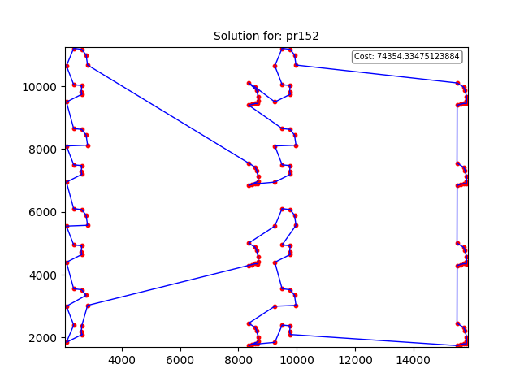

# evo_bio_computing
Implementations of heuristics, metaheuristics, evolutionary algorithms, and
bioinspired algorithms.

## Description
This repository contains implementations of heuristic, metaheuristic,
evolutionary, and bioinspired algorithms applied to optimization problems,
such as the Euclidean Traveling Salesman Problem (TSP). A genetic
algorithm (GA) approach is used to find solutions, and tools are provided
to visualize both the algorithm’s performance and the generated solutions
graphically.

## Requirements

Before getting started, make sure you have the following requirements
installed on your system:

- **Python3.10+** Python is required to run this project.


## Before Running the Project

Before running the project, you need to create a virtual environment and
install the required dependencies. The following steps will guide you
through this process.

- **Create and set up the virtual environment:** In this repo directory,
execute the following commands:

```bash
./build_venv.sh
```

This will create a virtual environment called `evo_bio_comp_venv`, activate it,
install the dependencies listed in `requirements.txt` and then deactivate the venv.

- **Activate the virtual environment:** Whenever you want to run the project,
make sure to activate the virtual environment:

```bash
source ./activate.sh
```

- **Deactivate the virtual environment:** When you're done working, deactivate
the virtual environment by running:

```bash
deactivate
```

### Running the Genetic Algorithm and Visualizing Results

To execute the genetic algorithm and write the best route found during the GA
use the following command:

```bash
./python_script.sh src/tsp/ga_for_euclidean_tsp.py instances/euc_TSP/berlin52.tsp results/test "{'pop_size': 20, 'gens': 20, 'seed': None, 'mutation_proba': 0.01, 'replacement': 'full_gen_replacement_elitist', 'local_s_iters': 3, 'max_records': 5000}"
```

Where `./python_script.sh` is used to run any script of this project, followed by the
route of the script and in this case the following argument is the route of the output files which in
this case are a `.txt` file with the route of the best route found during the GA and a `csv` with
the amount of entries as `'max_records'` were given and those entries are the best found solution
at a given time in the GA (i.e. the performance of the GA), it is recommended to always use the `results`
directory. It is also posible to add a prefix to the output files adding the prefix after the last
directory in the route.

Like in the previous example we added the prefix `test`.

Then you can plot the solution generated by the GA using

```bash
./python_script.sh src/tsp/plot_solution.py results/test_solution_berlin52.txt results/test
```
Where the first argument is the script that generates the plot of the solution,
the second arguent is the solution to plot (produced by previous script for the GA execution)
and the last argument is the desired route to save the `.png`.

### Examples



